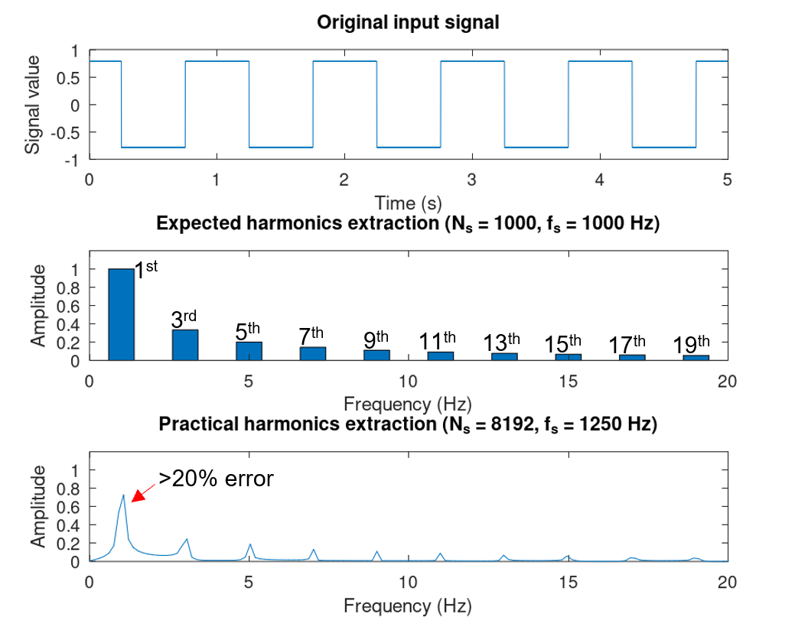
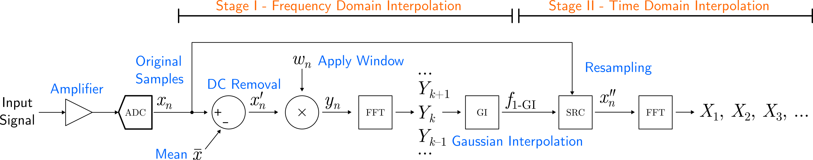
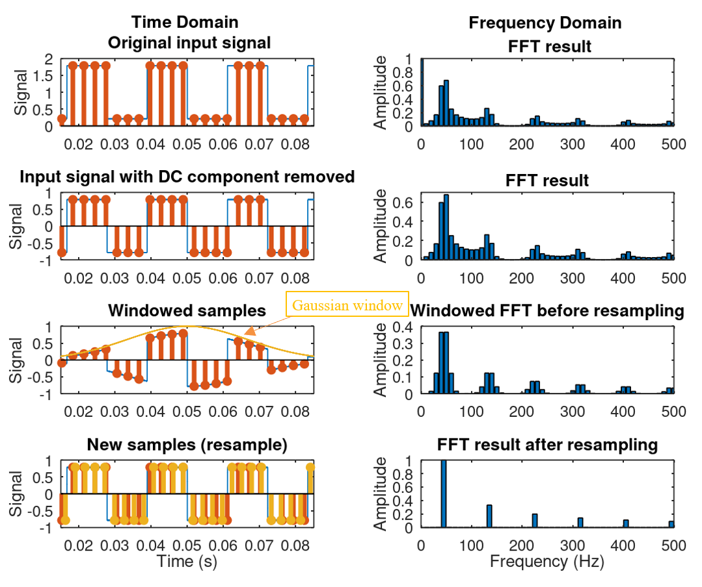

# DIFFT: Double-Interpolation FFT for Accurate Harmonic Extraction

DIFFT is an open-source collection of implementations for the Double-Interpolation FFT method proposed in the paper *"An Improved Accuracy Harmonic Extraction Method for Microcontrollers" (Tian & Zhang, 2025)*. This method provides high-accuracy harmonic amplitude and phase extraction suitable for resource-constrained embedded systems.

> 🚧 **Project Under Construction** 🚧  
This repository is currently under active development.  
Implementations, tests, and documentation are being added and refined.  
Expect frequent updates, breaking changes, and incomplete features.

We welcome early feedback and contributions—please feel free to open issues or submit pull requests.

## 🚀 Features

- **High accuracy** harmonic extraction for unknown frequency signals
- Suitable for **low-memory microcontrollers** (e.g., STM32, TMS320)
- Efficient use of **hardware-accelerated FFT** libraries

## 📂 Directory Structure

```
DIFFT/
├── matlab/                      # MATLAB / GNU Octave implementation
│   ├── src/                    # Core DIFFT functions
│   └── examples/              # Signal generation and test scripts
├── python/                     # Python implementation (NumPy/SciPy-based)
│   ├── src/
│   ├── tests/
│   └── notebooks/             # Jupyter notebooks for demonstration
├── c/                          # C implementation (with FFTPACK or CMSIS DSP)
│   ├── src/                   # Core algorithm
│   ├── fftpack/               # FFTPACK source (if included)
│   ├── stm32/                 # STM32-specific implementation (e.g. HAL/DMA)
│   └── tms320/                # TMS320-specific optimizations
├── benchmarks/                # Performance benchmarks and results
│   ├── memory_usage.md
│   ├── timing_results.md
│   └── accuracy_comparison.md
├── docs/                      # Documentation and theory reference
│   ├── paper_summary.md
│   └── method_theory.md
├── test_data/                 # Example waveforms and test vectors
│   ├── standard_waves.csv
│   └── rectifier_waveform.csv
├── LICENSE
└── README.md
```

## 🧠 Background

In many control and monitoring systems, especially on microcontrollers with limited memory and CPU power, FFT-based harmonic analysis suffers from **spectral leakage** and **bin alignment errors**. For example, when taking an 8k point FFT on a square wave signal with unmatched bin size, the extracted amplitudes of the fundamental could have more than 20% error from the expected value.



The DIFFT method solves this by:

1. **Gaussian interpolation** to estimate the exact fundamental frequency.
2. **Sample Rate Conversion (SRC)** to align harmonic frequencies to FFT bins.
3. A **second FFT** that yields accurate amplitudes and phases.




This method is verified on:
- GNU Octave (floating-point)
- STM32F412 microcontroller (fixed sampling rate, 12-bit ADC)
- TMS320 DSP family

## 📊 Benchmarks

Compared with traditional methods (e.g., PLL or straight FFT), DIFFT achieves:
- <1% error for harmonics up to 11th order
- ~3x–5x faster execution on STM32F4 compared to prior methods
- Lower memory footprint (<100kB RAM for dual-channel 8K samples)

## 🛠️ Getting Started

### Requirements

- MATLAB or Octave for the `matlab/` version
- Python 3.8+ with NumPy and SciPy for the `python/` version
- C compiler (e.g., GCC) for `c/` version; STM32CubeIDE or Code Composer for MCU targets

### Example (Python)
```bash
cd python/
python tests/run_test.py --input ../test_data/square_wave_50Hz.csv
```

## 📄 License

This project is licensed under the MIT License. See `LICENSE` for details.

## 🤝 Contributing

Contributions are welcome! Please see `CONTRIBUTING.md` for how to get involved.

## 📣 Citation

If you use this work in your research, please cite:

> Y. Tian and C. Zhang, "An Improved Accuracy Harmonic Extraction Method for Microcontrollers," in IEEE Transactions on Industrial Electronics, vol. 72, no. 5, pp. 5344-5352, May 2025, doi: 10.1109/TIE.2024.3472288. 
